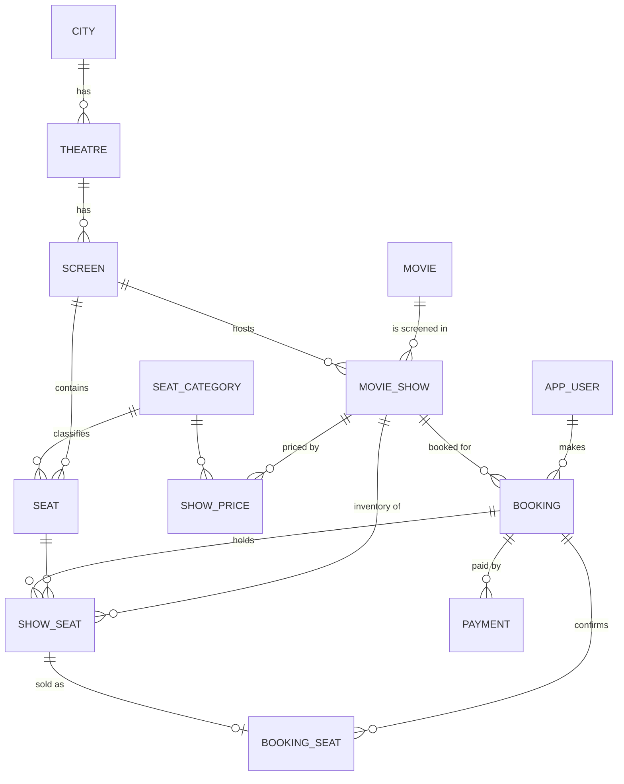

# BookMyShow-Scale Ticketing Backend: Database & System Design

---

## 1. Entities and relationships



| Entity | Attributes | Purpose |
|---|---|---|
| `city` | city_id, name, state | Location |
| `theatre` | theatre_id, city_id, name, address | A cinema in a city |
| `screen` | screen_id, theatre_id | An auditorium in a theatre |
| `seat_category` | category_id, name | Executive / Premium / Recliner |
| `seat` | seat_id, screen_id, category_id, row_label, seat_number | Physical seat of a screen |
| `movie` | movie_id, title, duration_min, release_date | Catalogue |
| `movie_show` | show_id, screen_id, movie_id, format, start_time, status | One screening of a movie on a screen |
| `show_price` | show_id, category_id, price | Price of a seat category for a show |
| `app_user` | user_id, full_name, email, phone, created_at | Customers |
| `booking` | booking_id, user_id, show_id, status, created_at, expires_at | Purchase attempt: `PENDING` → `CONFIRMED` / `EXPIRED` / `CANCELLED` |
| `show_seat` | show_seat_id, show_id, seat_id, status, hold_booking_id, version | **Per-show seat inventory**, the row that gets locked |
| `booking_seat` | booking_id, show_seat_id | Seats finally sold in a booking |
| `payment` | payment_id, booking_id, gateway_payment_id, amount, status, created_at, updated_at | Payment for a booking |

---

## 2. DDL (P1)

```sql
CREATE DATABASE IF NOT EXISTS bookmyshow
  CHARACTER SET utf8mb4 COLLATE utf8mb4_0900_ai_ci;

USE bookmyshow;

-- ---------- Location ----------
CREATE TABLE city (
  city_id   INT UNSIGNED NOT NULL AUTO_INCREMENT,
  name      VARCHAR(80)  NOT NULL,
  state     VARCHAR(80)  NOT NULL,
  PRIMARY KEY (city_id),
  UNIQUE KEY uq_city (name, state)
) ENGINE=InnoDB;

CREATE TABLE theatre (
  theatre_id INT UNSIGNED NOT NULL AUTO_INCREMENT,
  city_id    INT UNSIGNED NOT NULL,
  name       VARCHAR(120) NOT NULL,
  address    VARCHAR(255) NOT NULL,
  PRIMARY KEY (theatre_id),
  UNIQUE KEY uq_theatre (city_id, name),
  CONSTRAINT fk_theatre_city FOREIGN KEY (city_id) REFERENCES city (city_id)
) ENGINE=InnoDB;

CREATE TABLE screen (
  screen_id  INT UNSIGNED NOT NULL AUTO_INCREMENT,
  theatre_id INT UNSIGNED NOT NULL,
  PRIMARY KEY (screen_id),
  CONSTRAINT fk_screen_theatre FOREIGN KEY (theatre_id) REFERENCES theatre (theatre_id)
) ENGINE=InnoDB;                    -- the FK automatically indexes theatre_id (used by P2)

-- ---------- Seats ----------
CREATE TABLE seat_category (
  category_id TINYINT UNSIGNED NOT NULL AUTO_INCREMENT,
  name        VARCHAR(30) NOT NULL,
  PRIMARY KEY (category_id),
  UNIQUE KEY uq_category_name (name)
) ENGINE=InnoDB;

CREATE TABLE seat (
  seat_id     INT UNSIGNED NOT NULL AUTO_INCREMENT,
  screen_id   INT UNSIGNED NOT NULL,
  category_id TINYINT UNSIGNED NOT NULL,
  row_label   VARCHAR(2)  NOT NULL,
  seat_number SMALLINT UNSIGNED NOT NULL,
  PRIMARY KEY (seat_id),
  UNIQUE KEY uq_seat_position (screen_id, row_label, seat_number),
  CONSTRAINT fk_seat_screen   FOREIGN KEY (screen_id)   REFERENCES screen (screen_id),
  CONSTRAINT fk_seat_category FOREIGN KEY (category_id) REFERENCES seat_category (category_id)
) ENGINE=InnoDB;

-- ---------- Catalogue ----------
CREATE TABLE movie (
  movie_id     INT UNSIGNED NOT NULL AUTO_INCREMENT,
  title        VARCHAR(150) NOT NULL,
  duration_min SMALLINT UNSIGNED NOT NULL,
  release_date DATE         NOT NULL,
  PRIMARY KEY (movie_id)
) ENGINE=InnoDB;

-- ---------- Shows ----------
CREATE TABLE movie_show (
  show_id     INT UNSIGNED NOT NULL AUTO_INCREMENT,
  screen_id   INT UNSIGNED NOT NULL,
  movie_id    INT UNSIGNED NOT NULL,
  format      ENUM('2D','3D','IMAX') NOT NULL DEFAULT '2D',
  start_time  DATETIME NOT NULL,
  status      ENUM('SCHEDULED','CANCELLED','COMPLETED') NOT NULL DEFAULT 'SCHEDULED',
  PRIMARY KEY (show_id),
  UNIQUE KEY uq_show_screen_time (screen_id, start_time),   -- no two shows start together; also THE index for P2
  KEY idx_show_movie_time (movie_id, start_time),
  CONSTRAINT fk_show_screen FOREIGN KEY (screen_id) REFERENCES screen (screen_id),
  CONSTRAINT fk_show_movie  FOREIGN KEY (movie_id)  REFERENCES movie (movie_id)
) ENGINE=InnoDB;

CREATE TABLE show_price (
  show_id     INT UNSIGNED     NOT NULL,
  category_id TINYINT UNSIGNED NOT NULL,
  price       DECIMAL(8,2)     NOT NULL CHECK (price >= 0),
  PRIMARY KEY (show_id, category_id),
  CONSTRAINT fk_sp_show     FOREIGN KEY (show_id)     REFERENCES movie_show (show_id),
  CONSTRAINT fk_sp_category FOREIGN KEY (category_id) REFERENCES seat_category (category_id)
) ENGINE=InnoDB;

-- ---------- Users, bookings ----------
CREATE TABLE app_user (
  user_id    BIGINT UNSIGNED NOT NULL AUTO_INCREMENT,
  full_name  VARCHAR(120) NOT NULL,
  email      VARCHAR(190) NOT NULL,
  phone      VARCHAR(20)  NOT NULL,
  created_at TIMESTAMP    NOT NULL DEFAULT CURRENT_TIMESTAMP,
  PRIMARY KEY (user_id),
  UNIQUE KEY uq_user_email (email),
  UNIQUE KEY uq_user_phone (phone)
) ENGINE=InnoDB;

CREATE TABLE booking (
  booking_id BIGINT UNSIGNED NOT NULL AUTO_INCREMENT,
  user_id    BIGINT UNSIGNED NOT NULL,
  show_id    INT UNSIGNED    NOT NULL,
  status     ENUM('PENDING','CONFIRMED','EXPIRED','CANCELLED') NOT NULL DEFAULT 'PENDING',
  created_at DATETIME NOT NULL DEFAULT CURRENT_TIMESTAMP,
  expires_at DATETIME NOT NULL,                      -- hold deadline (created_at + 10 min)
  PRIMARY KEY (booking_id),
  KEY idx_booking_user (user_id, created_at),
  CONSTRAINT fk_booking_user FOREIGN KEY (user_id) REFERENCES app_user (user_id),
  CONSTRAINT fk_booking_show FOREIGN KEY (show_id) REFERENCES movie_show (show_id)
) ENGINE=InnoDB;

-- Per-show seat inventory: the row that gets locked
CREATE TABLE show_seat (
  show_seat_id    BIGINT UNSIGNED NOT NULL AUTO_INCREMENT,
  show_id         INT UNSIGNED    NOT NULL,
  seat_id         INT UNSIGNED    NOT NULL,
  status          ENUM('AVAILABLE','HELD','BOOKED') NOT NULL DEFAULT 'AVAILABLE',
  hold_booking_id BIGINT UNSIGNED NULL,                -- who holds it (only while HELD)
  version         INT UNSIGNED    NOT NULL DEFAULT 0,  -- optimistic-locking counter
  PRIMARY KEY (show_seat_id),
  UNIQUE KEY uq_show_seat (show_id, seat_id),          -- a seat exists once per show
  KEY idx_show_status (show_id, status),               -- seat-map / availability counts
  CONSTRAINT fk_ss_show    FOREIGN KEY (show_id)         REFERENCES movie_show (show_id),
  CONSTRAINT fk_ss_seat    FOREIGN KEY (seat_id)         REFERENCES seat (seat_id),
  CONSTRAINT fk_ss_booking FOREIGN KEY (hold_booking_id) REFERENCES booking (booking_id)
) ENGINE=InnoDB;

-- Seats finally sold. UNIQUE(show_seat_id) is the last-line guard against double-booking.
CREATE TABLE booking_seat (
  booking_id   BIGINT UNSIGNED NOT NULL,
  show_seat_id BIGINT UNSIGNED NOT NULL,
  PRIMARY KEY (booking_id, show_seat_id),
  UNIQUE KEY uq_sold_once (show_seat_id),
  CONSTRAINT fk_bs_booking   FOREIGN KEY (booking_id)   REFERENCES booking (booking_id),
  CONSTRAINT fk_bs_show_seat FOREIGN KEY (show_seat_id) REFERENCES show_seat (show_seat_id)
) ENGINE=InnoDB;

-- ---------- Payments ----------
-- gateway_payment_id is NULL until the gateway confirms; UNIQUE makes it the idempotency key.
CREATE TABLE payment (
  payment_id         BIGINT UNSIGNED NOT NULL AUTO_INCREMENT,
  booking_id         BIGINT UNSIGNED NOT NULL,
  gateway_payment_id VARCHAR(64)     NULL,
  amount             DECIMAL(10,2)   NOT NULL,
  status ENUM('INITIATED','SUCCESS','FAILED','REFUND_REQUIRED','REFUNDED')
         NOT NULL DEFAULT 'INITIATED',
  created_at DATETIME NOT NULL DEFAULT CURRENT_TIMESTAMP,
  updated_at DATETIME NOT NULL DEFAULT CURRENT_TIMESTAMP ON UPDATE CURRENT_TIMESTAMP,
  PRIMARY KEY (payment_id),
  UNIQUE KEY uq_gateway_payment (gateway_payment_id),  -- multiple NULLs are allowed
  KEY idx_payment_booking (booking_id),
  CONSTRAINT fk_payment_booking FOREIGN KEY (booking_id) REFERENCES booking (booking_id)
) ENGINE=InnoDB;
```

### Guard trigger: no overlapping shows on one screen

`UNIQUE(screen_id, start_time)` only stops identical start times. This trigger rejects any overlap, including a 15-minute cleaning buffer. 
## 3. Sample data

```sql
INSERT INTO city (city_id, name, state) VALUES
 (1,'Mumbai','Maharashtra'), (2,'Pune','Maharashtra');

INSERT INTO theatre (theatre_id, city_id, name, address) VALUES
 (1,1,'Cinepolis Andheri','Andheri West, Mumbai'),
 (2,1,'PVR Lower Parel','Lower Parel, Mumbai');

INSERT INTO screen (screen_id, theatre_id) VALUES
 (1,1), (2,1), (3,2);                       -- screens 1,2 belong to theatre 1; screen 3 to theatre 2

INSERT INTO seat_category (category_id, name) VALUES
 (1,'Executive'), (2,'Premium'), (3,'Recliner');

-- Screen 1: row A (Premium) and row B (Executive), 4 seats each; Screen 2: 2 Premium seats
INSERT INTO seat (seat_id, screen_id, category_id, row_label, seat_number) VALUES
 (1,1,2,'A',1),(2,1,2,'A',2),(3,1,2,'A',3),(4,1,2,'A',4),
 (5,1,1,'B',1),(6,1,1,'B',2),(7,1,1,'B',3),(8,1,1,'B',4),
 (9,2,2,'A',1),(10,2,2,'A',2);

INSERT INTO movie (movie_id, title, duration_min, release_date) VALUES
 (1,'Stellar Run',148,'2026-09-12'),
 (2,'Monsoon Diaries',126,'2026-09-19'),
 (3,'Night Shift',112,'2026-09-26');

INSERT INTO movie_show (show_id, screen_id, movie_id, format, start_time) VALUES
 (1,1,1,'2D','2026-09-30 10:00:00'),
 (2,1,1,'2D','2026-09-30 14:00:00'),
 (3,1,2,'2D','2026-09-30 18:30:00'),
 (4,2,1,'3D','2026-09-30 13:00:00'),
 (5,2,3,'2D','2026-09-30 21:00:00'),
 (6,1,1,'2D','2026-10-01 10:00:00'),
 (7,3,2,'2D','2026-09-30 11:00:00');        -- different theatre (screen 3)

INSERT INTO show_price (show_id, category_id, price) VALUES
 (1,2,350.00),(1,1,250.00),
 (2,2,380.00),(2,1,280.00),
 (3,2,300.00),(3,1,220.00);

-- Seat inventory of a show is generated from the physical seats of its screen
INSERT INTO show_seat (show_id, seat_id)
SELECT s.show_id, st.seat_id
FROM movie_show s JOIN seat st ON st.screen_id = s.screen_id
WHERE s.show_id = 1
ORDER BY st.seat_id;                        -- show_seat_id 1..8 = seat_id 1..8

INSERT INTO app_user (user_id, full_name, email, phone) VALUES
 (1,'Aarav Mehta','aarav@example.com','+919800000001'),
 (2,'Isha Kulkarni','isha@example.com','+919800000002');

-- Booking 1: confirmed (A1, A2). Booking 2: pending hold (A3), expires in 10 minutes.
INSERT INTO booking (booking_id, user_id, show_id, status, created_at, expires_at) VALUES
 (1,1,1,'CONFIRMED', NOW() - INTERVAL 1 HOUR, NOW() - INTERVAL 50 MINUTE),
 (2,2,1,'PENDING',   NOW(),                   NOW() + INTERVAL 10 MINUTE);

UPDATE show_seat SET status='BOOKED', version=version+1 WHERE show_id=1 AND seat_id IN (1,2);
UPDATE show_seat SET status='HELD', hold_booking_id=2, version=version+1 WHERE show_id=1 AND seat_id=3;

INSERT INTO booking_seat (booking_id, show_seat_id) VALUES (1,1),(1,2);

INSERT INTO payment (payment_id, booking_id, gateway_payment_id, amount, status) VALUES
 (1,1,'pay_7c3d4',700.00,'SUCCESS'),
 (2,2,NULL,350.00,'INITIATED');
```

### Example rows (as stored)

**movie_show**

| show_id | screen_id | movie_id | format | start_time | status |
|---|---|---|---|---|---|
| 1 | 1 | 1 | 2D | 2026-09-30 10:00 | SCHEDULED |
| 2 | 1 | 1 | 2D | 2026-09-30 14:00 | SCHEDULED |
| 4 | 2 | 1 | 3D | 2026-09-30 13:00 | SCHEDULED |

**show_seat** (show 1)

| show_seat_id | show_id | seat_id | status | hold_booking_id | version |
|---|---|---|---|---|---|
| 1 | 1 | 1 (A1) | BOOKED | NULL | 1 |
| 2 | 1 | 2 (A2) | BOOKED | NULL | 1 |
| 3 | 1 | 3 (A3) | HELD | 2 | 1 |
| 4 | 1 | 4 (A4) | AVAILABLE | NULL | 0 |

**booking / payment**

| booking_id | user_id | show_id | status | expires_at | payment_id | gateway_payment_id | amount | payment status |
|---|---|---|---|---|---|---|---|---|
| 1 | 1 | 1 | CONFIRMED | (past) | 1 | pay_7c3d4 | 700.00 | SUCCESS |
| 2 | 2 | 1 | PENDING | now + 10 min | 2 | NULL | 350.00 | INITIATED |

---

## 4. Normalization (1NF → BCNF)

**1NF:** Every column is atomic. There are no repeating groups such as `seats = "A1,A2"`; the seats of a booking are rows of `booking_seat`. Every table has a primary key.

**2NF:** The composite-key tables are `show_price (show_id, category_id)` and `booking_seat (booking_id, show_seat_id)`. `price` depends on the whole (show, category) pair. `booking_seat` has no non-key attributes, so partial dependencies cannot exist.

**3NF / BCNF:** In every table the only determinants are candidate keys.

| Table | Candidate keys | Notes |
|---|---|---|
| `city` | `city_id`, `(name,state)` | |
| `theatre` | `theatre_id`, `(city_id,name)` | City name and state are not repeated here. |
| `screen` | `screen_id` | Only its parent theatre is stored. |
| `seat` | `seat_id`, `(screen_id,row_label,seat_number)` | The category *name* lives in `seat_category`. |
| `movie_show` | `show_id`, `(screen_id,start_time)` | The theatre is **not** stored here. It is derived via `screen`, so there is no `show → screen → theatre` transitive dependency. `end_time` is deliberately absent, since it is derivable from `movie.duration_min`. |
| `show_price` | `(show_id,category_id)` | |
| `show_seat` | `show_seat_id`, `(show_id,seat_id)` | The hold **expiry is not stored here**. It depends on the booking (`booking_id → expires_at`), so keeping it on the seat would be a transitive dependency. |
| `booking` | `booking_id` | No `total_amount`. The charged amount lives in `payment.amount`. |
| `booking_seat` | `(booking_id,show_seat_id)`, `show_seat_id` | All-key table, so it is trivially BCNF. |
| `payment` | `payment_id`, `gateway_payment_id` | `amount` is the money requested from the gateway. |

There is no stored price per sold seat. A seat's price is derived as `show_price ⨝ seat.category_id`, and the actual amount charged is preserved in `payment.amount`. `show_seat.status = BOOKED` mirrors the existence of a `booking_seat` row. It is written in the same transaction, and the `UNIQUE` key on `booking_seat` is the authority.

---


## 5. P2: list all shows for a theatre on a date

```sql
SET @theatre_id = 1;
SET @show_date  = '2026-09-30';

-- P2 (main): every show at the theatre on that date, with timing
SELECT
    m.title                                       AS movie,
    s.format,
    sc.screen_id                                  AS screen,
    s.show_id,
    TIME_FORMAT(TIME(s.start_time), '%h:%i %p')   AS show_time
FROM movie_show s
JOIN screen sc ON sc.screen_id = s.screen_id
JOIN movie  m  ON m.movie_id   = s.movie_id
WHERE sc.theatre_id = @theatre_id
  AND s.start_time >= @show_date                          -- sargable range, not DATE(start_time)=...
  AND s.start_time <  @show_date + INTERVAL 1 DAY
  AND s.status = 'SCHEDULED'
ORDER BY m.title, s.format, s.start_time;
```

**Output for the sample data**

| movie | format | screen | show_id | show_time |
|---|---|---|---|---|
| Monsoon Diaries | 2D | 1 | 3 | 06:30 PM |
| Night Shift | 2D | 2 | 5 | 09:00 PM |
| Stellar Run | 2D | 1 | 1 | 10:00 AM |
| Stellar Run | 2D | 1 | 2 | 02:00 PM |
| Stellar Run | 3D | 2 | 4 | 01:00 PM |

**Same data, grouped like the BookMyShow UI (one row per movie and format):**

```sql
SELECT
    m.movie_id,
    m.title,
    s.format,
    GROUP_CONCAT(TIME_FORMAT(TIME(s.start_time), '%h:%i %p')
                 ORDER BY s.start_time SEPARATOR ', ') AS show_timings
FROM movie_show s
JOIN screen sc ON sc.screen_id = s.screen_id
JOIN movie  m  ON m.movie_id   = s.movie_id
WHERE sc.theatre_id = @theatre_id
  AND s.start_time >= @show_date
  AND s.start_time <  @show_date + INTERVAL 1 DAY
  AND s.status = 'SCHEDULED'
GROUP BY m.movie_id, m.title, s.format
ORDER BY m.title, s.format;
```

| movie_id | title | format | show_timings |
|---|---|---|---|
| 2 | Monsoon Diaries | 2D | 06:30 PM |
| 3 | Night Shift | 2D | 09:00 PM |
| 1 | Stellar Run | 2D | 10:00 AM, 02:00 PM |
| 1 | Stellar Run | 3D | 01:00 PM |

**The "next 7 dates" strip** (dates with at least one show are the ones to enable):

```sql
WITH RECURSIVE next7 AS (
  SELECT CURDATE() AS show_date
  UNION ALL
  SELECT show_date + INTERVAL 1 DAY FROM next7 WHERE show_date < CURDATE() + INTERVAL 6 DAY
)
SELECT n.show_date, COUNT(x.show_id) AS shows
FROM next7 n
LEFT JOIN (
    SELECT s.show_id, s.start_time
    FROM movie_show s JOIN screen sc ON sc.screen_id = s.screen_id
    WHERE sc.theatre_id = @theatre_id AND s.status = 'SCHEDULED'
) x ON x.start_time >= n.show_date AND x.start_time < n.show_date + INTERVAL 1 DAY
GROUP BY n.show_date
ORDER BY n.show_date;
```
